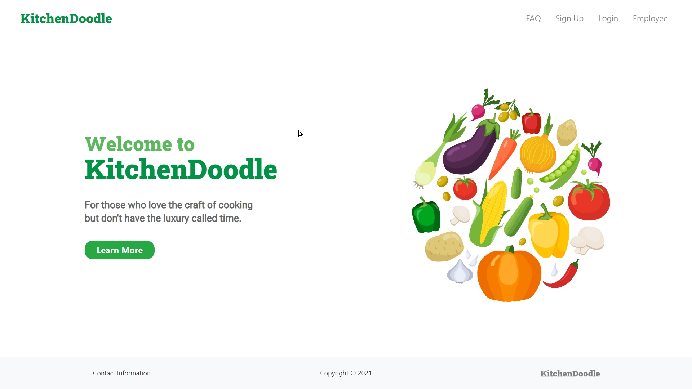
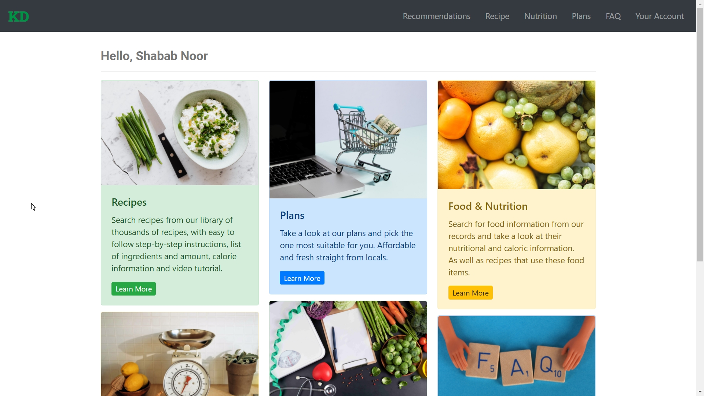
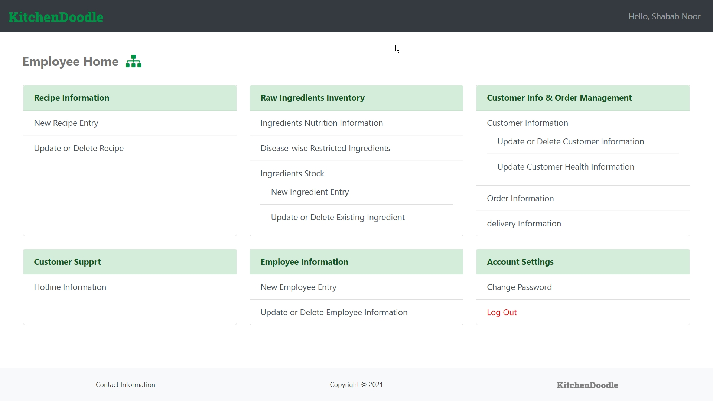
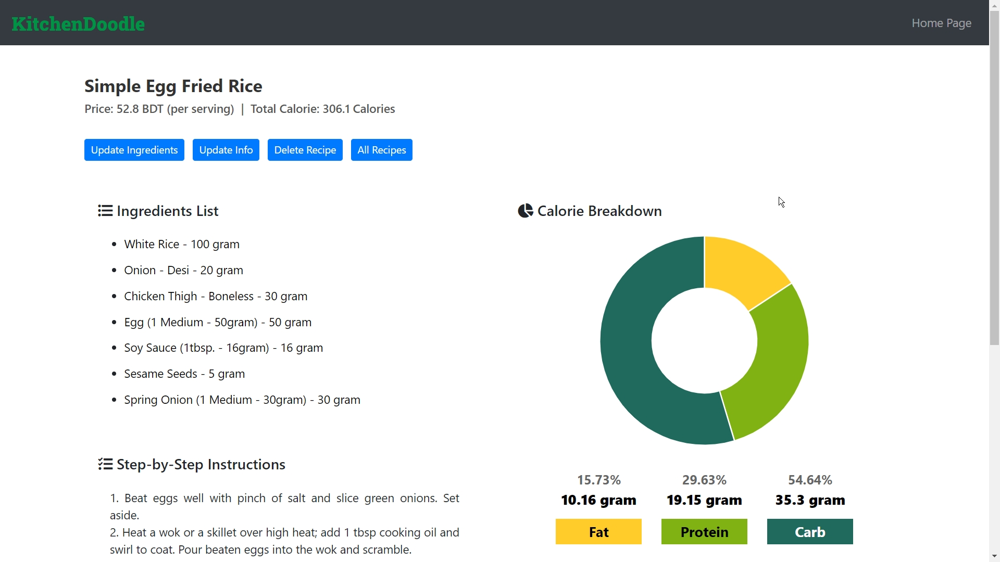
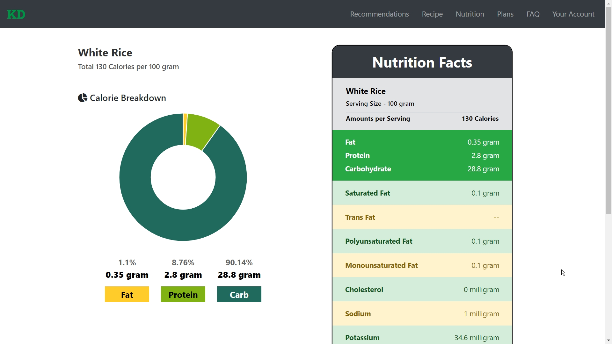

# KitchenDoodle

KitchenDoodle is a meal-kit delivery service. 

### DBMS Lab – CSE 3522 – Spring 2021 
#### Database Management Systems Laboratory
 

> Student’s Name	: Ahmed Shabab Noor  
> Student’s ID		: 011 193 024  
> Project Name	: KitchenDoodle  

 

#### About Page
# 

#### User Home Page
# 

#### Admin Home Page
# 

#### Admin Recipe Page
# 

#### User Food Attributes Page
# 
